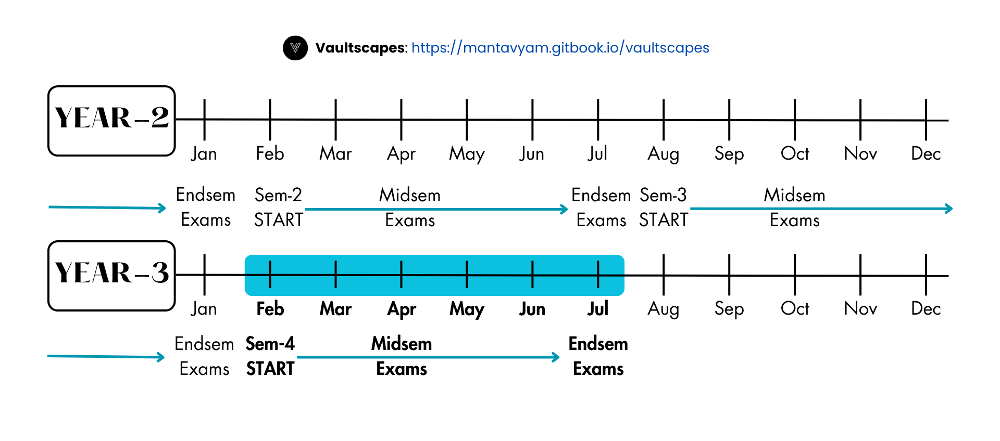

# Overview - Semester 4

## Syllabus



## Exam Schedule

<figure><figcaption></figcaption></figure>

## Subject Wise Resources

<table data-view="cards"><thead><tr><th data-type="content-ref"></th><th data-hidden data-card-cover data-type="files"></th></tr></thead><tbody><tr><td><a href="cse401-discrete-maths.md">cse401-discrete-maths.md</a></td><td><a href=".gitbook/assets/Sub-Icon-Y2S4-VAULTSCAPES-MAT.png">Sub-Icon-Y2S4-VAULTSCAPES-MAT.png</a></td></tr><tr><td><a href="cse402-coa.md">cse402-coa.md</a></td><td><a href=".gitbook/assets/Sub-Icon-Y2S4-VAULTSCAPES-COA.png">Sub-Icon-Y2S4-VAULTSCAPES-COA.png</a></td></tr><tr><td><a href="cse403-java-programming/">cse403-java-programming</a></td><td><a href=".gitbook/assets/Sub-Icon-Y2S4-VAULTSCAPES-JP.png">Sub-Icon-Y2S4-VAULTSCAPES-JP.png</a></td></tr><tr><td><a href="cse403-java-programming/cse423-java-lab.md">cse423-java-lab.md</a></td><td><a href=".gitbook/assets/Sub-Icon-Y2S4-VAULTSCAPES-JP.png">Sub-Icon-Y2S4-VAULTSCAPES-JP.png</a></td></tr><tr><td><a href="cse404-os/">cse404-os</a></td><td><a href=".gitbook/assets/Sub-Icon-Y2S4-VAULTSCAPES-OS.png">Sub-Icon-Y2S4-VAULTSCAPES-OS.png</a></td></tr><tr><td><a href="cse404-os/cse424-os-lab.md">cse424-os-lab.md</a></td><td><a href=".gitbook/assets/Sub-Icon-Y2S4-VAULTSCAPES-OS.png">Sub-Icon-Y2S4-VAULTSCAPES-OS.png</a></td></tr><tr><td><a href="it401-formal-lang-and-automata.md">it401-formal-lang-and-automata.md</a></td><td><a href=".gitbook/assets/Sub-Icon-Y2S4-VAULTSCAPES-FLAT.png">Sub-Icon-Y2S4-VAULTSCAPES-FLAT.png</a></td></tr><tr><td><a href="it402-cyber-security-digital-forensics.md">it402-cyber-security-digital-forensics.md</a></td><td><a href=".gitbook/assets/Sub-Icon-Y2S4-VAULTSCAPES-CSDF.png">Sub-Icon-Y2S4-VAULTSCAPES-CSDF.png</a></td></tr><tr><td><a href="bcu441-communication.md">bcu441-communication.md</a></td><td><a href=".gitbook/assets/Sub-Icon-Y2S4-VAULTSCAPES-BCU.png">Sub-Icon-Y2S4-VAULTSCAPES-BCU.png</a></td></tr><tr><td><a href="bsu443-behaviour.md">bsu443-behaviour.md</a></td><td><a href=".gitbook/assets/Sub-Icon-Y2S4-VAULTSCAPES-BSU.png">Sub-Icon-Y2S4-VAULTSCAPES-BSU.png</a></td></tr><tr><td><a href="flu444-french.md">flu444-french.md</a></td><td><a href=".gitbook/assets/Sub-Icon-Y2S4-VAULTSCAPES-FLU.png">Sub-Icon-Y2S4-VAULTSCAPES-FLU.png</a></td></tr><tr><td><a href="specialisation/csc401-cyber-security.md">csc401-cyber-security.md</a></td><td><a href=".gitbook/assets/Sub-Icon-Y2S4-VAULTSCAPES-CSC.png">Sub-Icon-Y2S4-VAULTSCAPES-CSC.png</a></td></tr><tr><td><a href="specialisation/csa401-ai-and-ml.md">csa401-ai-and-ml.md</a></td><td><a href=".gitbook/assets/Sub-Icon-Y2S4-VAULTSCAPES-CSA.png">Sub-Icon-Y2S4-VAULTSCAPES-CSA.png</a></td></tr><tr><td><a href="specialisation/csd401-data-science.md">csd401-data-science.md</a></td><td><a href=".gitbook/assets/Sub-Icon-Y2S4-VAULTSCAPES-CSD.png">Sub-Icon-Y2S4-VAULTSCAPES-CSD.png</a></td></tr><tr><td><a href="specialisation/csi401-iot.md">csi401-iot.md</a></td><td><a href=".gitbook/assets/Sub-Icon-Y2S4-VAULTSCAPES-CSI.png">Sub-Icon-Y2S4-VAULTSCAPES-CSI.png</a></td></tr></tbody></table>

## Notes

\[⤓] [CSE404-OS-M1-EVOLUTION-FULL-NOTES-BTECH](https://drive.google.com/file/d/1PuI3Z-n0hgfTaBcJlnDoHNFk3zzfNK_r/view?usp=drive_link)

\[⤓] [CSE404-OS-M2-PROCESS-FULL-NOTES-BTECH](https://drive.google.com/file/d/1Q0M9Wz3amh8EmOuN8GP_SIBQGq869Usb/view?usp=drive_link)

\[⤓] [CSE404-OS-M3-MEMORY-FULL-NOTES-BTECH](https://drive.google.com/file/d/160PCaPCtaA2w6QVCRnR2V-bLS6GS443a/view?usp=drive_link)

\[⤓] [CSE401-MATHS-M1-MidTerm-SHORT-NOTES](https://drive.google.com/file/d/1oUJisGyWAAvLDlkQ1HNsgg03psMI6ThL/view?usp=drive_link)

\[⤓] [CSE401-MATHS-M2-MidTerm-SHORT-NOTES](https://drive.google.com/file/d/1_n0uSbW9Ca1f9WIQTOI5r2qDC2osgwub/view?usp=drive_link)

\[⤓] [CSE402-COA-M1-MidTerm-Concept-Outline](https://drive.google.com/file/d/1KKInOzvp3ni7C4QzoyP1xslMJ4Hb4Di-/view?usp=drive_link)

\[⤓] [CSE402-COA-M2-MidTerm-Concept-Outline](https://drive.google.com/file/d/1153rDcHtivq5MevEmw22ewmKKc9szLJn/view?usp=drive_link)

\[⤓] [CSE404-OS-M1+M2-MidTerm-SHORT-NOTES](https://drive.google.com/file/d/1dYg4_Wq6x5NVW2SM8WRaie25IUwdQs9L/view?usp=drive_link)

\[⤓] [FLU444-Grammar(UG)-MidTerm-SHORT-NOTES](https://drive.google.com/file/d/1O0bd6NYXws9QD1LfZvq7FHh_jBt8dKrG/view?usp=drive_link)

\[⤓] [FLU444-Speech-Acts(UG)-MidTerm-SHORT-NOTES](https://drive.google.com/file/d/1nlGP-JgMHvwsqMsr7sLSPB1FbWaCxr4Q/view?usp=drive_link)

\[⤓] [IT401-FLAT-M1-MidTerm-1-SHOT-NOTES](https://drive.google.com/file/d/1Mzb2etrYZOK9PPj0K6vO-3k_FuB_7rKE/view?usp=drive_link)

\[⤓] [IT401-FLAT-M2-MidTerm-1-SHOT-NOTES](https://drive.google.com/file/d/1cBvvFTAo6biqJkDmgnkleQAL-rtjmY6r/view?usp=drive_link)

\[⤓] [IT402-CSDF-M2-MidTerm-SHORT-NOTES](https://drive.google.com/file/d/1MBY5FdmU8WWs11_99q9FCp9Zo905f4n9/view?usp=drive_link)

\[⤓] [CSE403-JAVA-M1+M2-Concept-Outline](https://drive.google.com/file/d/1arcKn0epmsOa5NckrzvWC6z4Vc65d3VS/view?usp=drive_link)

\[⤓] [CSE403-JAVA-M1+M2-Short-Notes](https://drive.google.com/file/d/1JxtijaWtZ92wU3CsG2iA3Px3NDBBFoZO/view?usp=drive_link)

\[⤓] [CSE403-JAVA-One-Shot-SHORT-NOTES-COMPLETE](https://drive.google.com/file/d/18lbu2XFTbpj8mQBm-JEYcoAepho5S6OO/view?usp=drive_link)

\[⤓] [CSC401-CYBERSEC-M1-Concept-Outline](https://drive.google.com/file/d/113sRHoWP0Kl2c8-G4xoBLfsR3jGSozD4/view?usp=drive_link)

\[⤓] [CSC401-CYBERSEC-M2-Concept-Outline](https://drive.google.com/file/d/1atrD8-fz1iNoyLE9m6EMWI1tFu2bb0Jb/view?usp=drive_link)

\[⤓] [CSC401-CYBERSEC-M1+M2-MidTerm-SHORT-NOTES](https://drive.google.com/file/d/1QKhGRa790fKtpcOMTGHNnyDE-4PbWDPI/view?usp=drive_link)

\[⤓] [CSC401-CYBERSEC-M1+M2-Concept-Diagrams](https://drive.google.com/file/d/1ZCwo2cGxEUm3dGabQYcZc0a5AN7l-ZT8/view?usp=drive_link)

## Assignment Directory

\[⤓] [CSE402-COA-M2-Assignment](https://docs.google.com/document/d/13vyAmEzFa0ApjgeJ2y5MTPi5LilIzrg5/edit?usp=drive_link\&ouid=114560226846413789967\&rtpof=true\&sd=true)

\[⤓] [CSC401-CYBER-Assignment-MidTerm](https://drive.google.com/file/d/19H8KAEnhXWRkEDN3xBwsZ0KAZpw1uXSH/view?usp=drive_link)

## Previous Year Questions

### Mid-Sem-PYQs

\[⤓] [Y2S4-CSE401-MATHS-MidTerm-PYQ-APR25](https://drive.google.com/file/d/1sW5CptBSqsHL1CAQmar14JHv8Ud6gEWX/view?usp=drive_link)

\[⤓] [Y2S4-CSE402-COA-MidTerm-PYQ-APR25](https://drive.google.com/file/d/1Af6zjRDspolqE-hHnMS8FY_Evbo3VoAS/view?usp=drive_link)

\[⤓] [Y2S4-CSE404-OS-MidTerm-PYQ-APR25](https://drive.google.com/file/d/1qMajk2OWCY4SGxSyM1PRDtyN4GoMzUJe/view?usp=drive_link)

\[⤓] [Y2S4-CSE405-CNS-MidTerm-PYQ-1-APR25](https://drive.google.com/file/d/1Cgc4imevOssJab0wDK8jAgnQ418PzJYm/view?usp=drive_link)

\[⤓] [Y2S4-CSE405-CNS-MidTerm-PYQ-2-APR25](https://drive.google.com/file/d/1Cgc4imevOssJab0wDK8jAgnQ418PzJYm/view?usp=drive_link)

\[⤓] [Y2S4-IT401-FLAT-MidTerm-PYQ-APR25](https://drive.google.com/file/d/1ogMLZicIPjnuAdglwpLj17F80mjKFU3A/view?usp=drive_link)

\[⤓] [Y2S4-IT402-CSDF-MidTerm-PYQ-APR25](https://drive.google.com/file/d/1b1PhKfx_Qgq9vf5MWJgmHj3jsApRD_YS/view?usp=drive_link)

\[⤓] [Y2S4-FLU444-FRENCH-MidTerm-PYQ-APR25](https://drive.google.com/file/d/1FCUzBVC8R6ECEUzftq662fspi80cg7ZF/view?usp=drive_link)

\[⤓] [Y2S4-CSE403-JAVA-MidTerm-PYQ-1-Apr25](https://drive.google.com/file/d/1lAG2iwuteAw0KNVIlpFStckC7DUblDCb/view?usp=drive_link)

\[⤓] [Y2S4-CSE403-JAVA-MidTerm-PYQ-2-Apr25](https://drive.google.com/file/d/19jKfKhB7IcyOU2HutDOv_F4G9XNvXmq6/view?usp=drive_link)

\[⤓] [Y2S4-CSC401-CYBERSEC-MidTerm-PYQ-Apr25](https://drive.google.com/file/d/1UkKgMAVy_7ywe7HHOhvrMNEwMbqngjyM/view?usp=drive_link)

\[⤓] [Y2S4-CSA401-AI-MidTerm-PYQ-1-Apr25](https://drive.google.com/file/d/1bM41tvIzZFEp_rnS2gpoA1kaU8KEgveN/view?usp=drive_link)

\[⤓] [Y2S4-CSA401-AI-MidTerm-PYQ-2-Apr25](https://drive.google.com/file/d/1JTjdF6LBGp_tjxyMKkv2291OHKDo_iSR/view?usp=drive_link)

\[⤓] [Y2S4-CSD401-Data-Science-MidTerm-PYQ-Apr25](https://drive.google.com/file/d/1BcbHX60N9m71T9A-tsGGXBfi9rMf79AL/view?usp=drive_link)

\[⤓] [Y2S4-CSI401-IOT-MidTerm-PYQ-Apr25](https://drive.google.com/file/d/1r2tra6yIoHPb6PrKa5WBnJSrWYZKEG3A/view?usp=drive_link)

### End-Sem-PYQs

\[⤓] [Y2S4-CSE403-Java-EndTerm-PYQ-Jun22](https://drive.google.com/file/d/1inVzyv-T7CKJ4RFtHAHwsF0c7xHvxcDc/view?usp=drive_link)

\[⤓] [Y2S4-CSE403-Java-EndTerm-PYQ-Jun23](https://drive.google.com/file/d/1yX9Ub9FMs41oKJHsCG04FhLsL-9DErtS/view?usp=drive_link)

\[⤓] [Y2S4-CSE403-Java-EndTerm-PYQ-Jun24](https://drive.google.com/file/d/1MyOAF97ngMtzOKwJ0N0LaJJtslF8UQ36/view?usp=sharing)

\[⤓] [Y2S4-CSE401-Maths-EndTerm-PYQ-Jun22](https://drive.google.com/file/d/1PzxZvKyhB4oF3rbBRksqYFFxh08pDqVQ/view?usp=drive_link)

\[⤓] [Y2S4-CSE401-Maths-EndTerm-PYQ-Jun23](https://drive.google.com/file/d/12FdjhRSi8aC-jm1xrvCC3410y6ciToG9/view?usp=drive_link)

\[⤓] [Y2S4-CSE401-Maths-EndTerm-PYQ-Jun24](https://drive.google.com/file/d/1Qx4Xvbwu6Uhf_2vro1tB3iJrkLC5X7mB/view?usp=sharing)

\[⤓] [Y2S4-CSE402-COA-EndTerm-PYQ-Jun22](https://drive.google.com/file/d/1mr7ZHfm9q543xkm4T8TL0Rh7tPRc0wID/view?usp=drive_link)

\[⤓] [Y2S4-CSE402-COA-EndTerm-PYQ-Jun23](https://drive.google.com/file/d/1JLBfbKuuHGbx38SUQfd5EDUP1HgXtlN0/view?usp=drive_link)

\[⤓] [Y2S4-CSE402-COA-EndTerm-PYQ-Jun24](https://drive.google.com/file/d/1svDFr5INRUkz-ijX0Ki7N2dNC9owQd6a/view?usp=sharing)

\[⤓] [Y2S4-CSE404-OS-EndTerm-PYQ-Jun22](https://drive.google.com/file/d/1UaUD_pU7e_-VcTMsZHkF0M4siH-fx6cr/view?usp=drive_link)

\[⤓] [Y2S4-CSE404-OS-EndTerm-PYQ-Jun23](https://drive.google.com/file/d/1ECC14zNqsOCIW6BXM_2nWRk75IBYIEgS/view?usp=drive_link)

\[⤓] [Y2S4-CSE404-OS-EndTerm-PYQ-Jun24](https://drive.google.com/file/d/1IROdO-92Ue1i9IVKwDndy6Y6xbRoH-W8/view?usp=sharing)

\[⤓] [Y2S4-IT401-FLAT-EndTerm-PYQ-Jun23](https://drive.google.com/file/d/1Q1ef61UjBHZCXv4oyKafo_bUJsrGXWiH/view?usp=drive_link)

\[⤓] [Y2S4-FLU444-FRENCH-EndTerm-PYQ-Jun22](https://drive.google.com/file/d/1sGTXXafV4Zc1uvIqAdiqnVjXMiI1DvW2/view?usp=drive_link)

\[⤓] [Y2S4-BSU443-Behaviour-EndTerm-PYQ-Jun22](https://drive.google.com/file/d/1h31UA_Rl2gJx0II9sNVanGrMkNtG7MXq/view?usp=drive_link)

\[⤓] [Y2S4-CSA401-AI-EndTerm-PYQ-Jun22](https://drive.google.com/file/d/1gfSzeOAP8TaWHl5eaier2DGHubr8Gba5/view?usp=drive_link)

\[⤓] [Y2S4-CSD401-Data-Science-EndTerm-PYQ-Jun22](https://drive.google.com/file/d/1fHJVW-GT9craqA7mf7O0WbQ-oq6EIqSv/view?usp=drive_link)

\[⤓] [Y2S4-CSD401-Data-Science-EndTerm-PYQ-Jun23](https://drive.google.com/file/d/1FkJVyL5fTgfhovotMxja8KuFRpiBFl3H/view?usp=drive_link)

**(Additional PYQs) For Students of BTECH: Mechanical Engineering**

\[⤓] [Y2S4-BME401-Fluid-Mechanics-MidTerm-PYQ-Apr25](https://drive.google.com/file/d/1uMpBDaGurYHNe8JAW7hCt310IVamxlwY/view?usp=drive_link)

\[⤓] [Y2S4-BME403-KOM-MidTerm-PYQ-Apr25](https://drive.google.com/file/d/1fYd9LCFr4CJ1zqH62YOvS7CBXZijWfm-/view?usp=drive_link)

\[⤓] [Y2S4-BME404-Strength-of-Material-MidTerm-PYQ-Apr25](https://drive.google.com/file/d/1x0JkysZJg5C1wsT4SIU4TrYBkpfia1Sh/view?usp=drive_link)


Get Credited for sharing your Knowledge Source with your Peers



Submit Queries/Feedbacks/Suggestions/Complaints using this Form

