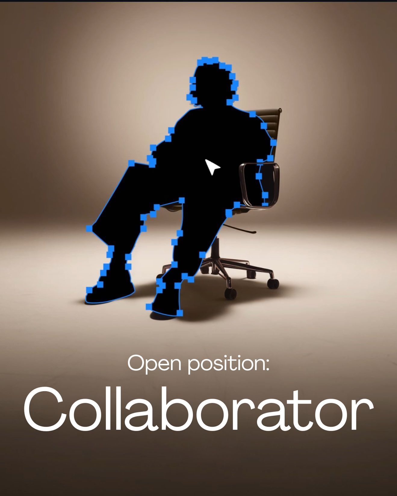

# Course Structure

<figure><figcaption>
Welcome to Vaultscapes: An Open-Source Academic Resource Sharing Database
</figcaption></figure>

<table data-view="cards"><thead><tr><th data-type="content-ref"></th><th data-hidden data-card-cover data-type="image">Cover image</th></tr></thead><tbody><tr><td><a href="https://app.gitbook.com/o/NkGE0lRg45bL5oWcCqAZ/s/3ZYLT7QIVGVNDP2woYe4/">Sem 1 / BTECH</a></td><td><a href=".gitbook/assets/BTECH-Y1S1-img-vaultscapes.png">BTECH-Y1S1-img-vaultscapes.png</a></td></tr><tr><td><a href="https://app.gitbook.com/o/NkGE0lRg45bL5oWcCqAZ/s/pXGn0qcI0EFL0b2TCKET/">Sem 2 / BTECH</a></td><td><a href=".gitbook/assets/BTECH-Y1S2-img-vaultscapes.png">BTECH-Y1S2-img-vaultscapes.png</a></td></tr><tr><td><a href="https://app.gitbook.com/o/NkGE0lRg45bL5oWcCqAZ/s/7uMP7Ghb8mcjzaqhpGZJ/">Sem 3 / BTECH</a></td><td><a href=".gitbook/assets/BTECH-Y2S3-img-vaultscapes.png">BTECH-Y2S3-img-vaultscapes.png</a></td></tr><tr><td><a href="https://app.gitbook.com/o/NkGE0lRg45bL5oWcCqAZ/s/zDcX1sSP1gmIRyZJgjfU/">Sem 4 / BTECH</a></td><td><a href=".gitbook/assets/BTECH-Y2S4-img-vaultscapes.png">BTECH-Y2S4-img-vaultscapes.png</a></td></tr><tr><td><a href="https://app.gitbook.com/o/NkGE0lRg45bL5oWcCqAZ/s/oWho7cxjZIbvsuDwIAzB/">Sem 5 / BTECH</a></td><td><a href=".gitbook/assets/BTECH-Y3S5-img-vaultscapes.png">BTECH-Y3S5-img-vaultscapes.png</a></td></tr><tr><td><a href="https://app.gitbook.com/o/NkGE0lRg45bL5oWcCqAZ/s/LN0puSSAgKgcy1Upnznn/">Sem 6 / BTECH</a></td><td><a href=".gitbook/assets/BTECH-Y3S6-img-vaultscapes.png">BTECH-Y3S6-img-vaultscapes.png</a></td></tr></tbody></table>


**We've All Been There—Let's Make It Easier Together.**

## Inspired by a resource here? Your turn to Add!

**Picture this:** Late nights, day before exam flipping through syllabus pages, piecing together notes from scattered sources. That's the course life we all know, right?&#x20;

_We've hit 400+ users strong, all pulling from the same pool of notes, syllabi, and PYQs that make the course feel more manageable. It's rewarding to see how these shares bridge gaps for coursemates and juniors alike, turning individual efforts into something collective._

_You've already found what you need; now, imagine adding your own bit. It takes just a minute to upload via our simple form—notes, a PYQ set, whatever you've got. Your content could be the one that helps someone else, the way others' have helped for you. It's the easy way to keep the good stuff circulating, the same way it's helped you settle into the semester. No big lifts, just us looking out for each other._

_If you're up for it, lend a hand with a quick upload—maybe your take on a tricky topic or an updated resource list. The form's straightforward, and every addition helps keep things fresh and relevant._&#x20;

_See the Contributor Wall? Yours could be next. Simple as that._



<a href="https://mantavyam.notion.site/18152f7cde8880d699a5f2e65f87374e?pvs=105" class="button primary" data-icon="arrow-up-to-arc">UPLOAD NOW</a>


What's One Thing You'd Share?



### STAR this Project on Github

If you find this project useful, please consider giving it a star on GitHub! ⭐

A star is a quick way to show your support and helps the project gain visibility.

[https://github.com/mantavyam/vaultscapesDB](https://github.com/mantavyam/vaultscapesDB)




***



## Semester 1


[Sem 1 / BTECH](https://app.gitbook.com/o/NkGE0lRg45bL5oWcCqAZ/s/3ZYLT7QIVGVNDP2woYe4/)


<table data-full-width="true"><thead><tr><th width="308" data-type="content-ref">CODE+SUBJECT</th><th width="92">CREDIT</th><th>TYPE</th></tr></thead><tbody><tr><td><a href="https://app.gitbook.com/s/3ZYLT7QIVGVNDP2woYe4/mat101">MAT101 / Mathematics</a></td><td>4</td><td>Compulsory</td></tr><tr><td><a href="https://app.gitbook.com/s/3ZYLT7QIVGVNDP2woYe4/che101">CHE101 / Chemistry</a></td><td>4</td><td>Compulsory</td></tr><tr><td><a href="https://app.gitbook.com/s/3ZYLT7QIVGVNDP2woYe4/che101/che121">CHE121 / Chemistry Lab</a></td><td>1</td><td>Compulsory</td></tr><tr><td><a href="https://app.gitbook.com/s/3ZYLT7QIVGVNDP2woYe4/cse104">CSE104 / Programming</a></td><td>3</td><td>Compulsory</td></tr><tr><td><a href="https://app.gitbook.com/s/3ZYLT7QIVGVNDP2woYe4/cse104/cse124">CSE124 / Programming Lab</a></td><td>1</td><td>Compulsory</td></tr><tr><td><a href="https://app.gitbook.com/s/3ZYLT7QIVGVNDP2woYe4/civ101">CIV101 / Civil Engineering</a></td><td>2</td><td>Compulsory</td></tr><tr><td><a href="https://app.gitbook.com/s/3ZYLT7QIVGVNDP2woYe4/bme124">BME124 / Workshop</a></td><td>1</td><td>Compulsory</td></tr><tr><td><a href="https://app.gitbook.com/s/3ZYLT7QIVGVNDP2woYe4/bsu143">BSU143 / Behaviour</a></td><td>1</td><td>Compulsory</td></tr><tr><td><a href="https://app.gitbook.com/s/3ZYLT7QIVGVNDP2woYe4/evs142">EVS142 / Environmental Science</a></td><td>2</td><td>Compulsory</td></tr><tr><td><a href="https://app.gitbook.com/s/3ZYLT7QIVGVNDP2woYe4/bcu141">BCU141 / Communication</a></td><td>1</td><td>Compulsory</td></tr><tr><td><a href="https://app.gitbook.com/s/3ZYLT7QIVGVNDP2woYe4/flu144">FLU144 / French</a></td><td>2</td><td>Compulsory</td></tr></tbody></table>

## Semester 2


[Sem 2 / BTECH](https://app.gitbook.com/o/NkGE0lRg45bL5oWcCqAZ/s/pXGn0qcI0EFL0b2TCKET/)


<table data-full-width="true"><thead><tr><th width="291" data-type="content-ref">CODE+SUBJECT</th><th width="99">CREDIT</th><th width="123">TYPE</th></tr></thead><tbody><tr><td><a href="https://app.gitbook.com/s/pXGn0qcI0EFL0b2TCKET/mat201">MAT201 / Mathematics</a></td><td>4</td><td>Compulsory</td></tr><tr><td><a href="https://app.gitbook.com/s/pXGn0qcI0EFL0b2TCKET/phy101">PHY101 / Physics</a></td><td>4</td><td>Compulsory</td></tr><tr><td><a href="https://app.gitbook.com/s/pXGn0qcI0EFL0b2TCKET/phy101/phy121">PHY121 / Physics Lab</a></td><td>1</td><td>Compulsory</td></tr><tr><td><a href="https://app.gitbook.com/s/pXGn0qcI0EFL0b2TCKET/cse204">CSE204 / C++</a></td><td>3</td><td>Compulsory</td></tr><tr><td><a href="https://app.gitbook.com/s/pXGn0qcI0EFL0b2TCKET/cse204/cse224">CSE224 / C++ Lab</a></td><td>1</td><td>Compulsory</td></tr><tr><td><a href="https://app.gitbook.com/s/pXGn0qcI0EFL0b2TCKET/ece101">ECE101 / Electrical Engineering</a></td><td>3</td><td>Compulsory</td></tr><tr><td><a href="https://app.gitbook.com/s/pXGn0qcI0EFL0b2TCKET/ece101/ece121">ECE121 / Electrical Engineering Lab</a></td><td>1</td><td>Compulsory</td></tr><tr><td><a href="https://app.gitbook.com/s/pXGn0qcI0EFL0b2TCKET/bme223">BME223 / Engineering Graphics</a></td><td>1</td><td>Compulsory</td></tr><tr><td><a href="https://app.gitbook.com/s/pXGn0qcI0EFL0b2TCKET/bsu243">BSU243 / Behavioural Science</a></td><td>1</td><td>Compulsory</td></tr><tr><td><a href="https://app.gitbook.com/s/pXGn0qcI0EFL0b2TCKET/evs242">EVS242 / Environmental Science</a></td><td>2</td><td>Compulsory</td></tr><tr><td><a href="https://app.gitbook.com/s/pXGn0qcI0EFL0b2TCKET/bcu241">BCU241 / Communication</a></td><td>1</td><td>Compulsory</td></tr><tr><td><a href="https://app.gitbook.com/s/pXGn0qcI0EFL0b2TCKET/flu244">FLU244 / French</a></td><td>2</td><td>Compulsory</td></tr></tbody></table>



## Semester 3


[Sem 3 / BTECH](https://app.gitbook.com/o/NkGE0lRg45bL5oWcCqAZ/s/7uMP7Ghb8mcjzaqhpGZJ/)


<table data-full-width="true"><thead><tr><th width="418">CODE+SUBJECT</th><th width="99">CREDIT</th><th width="123">TYPE</th></tr></thead><tbody><tr><td><a data-mention href="https://app.gitbook.com/s/7uMP7Ghb8mcjzaqhpGZJ/mat301">MAT301 / Mathematics</a></td><td>3</td><td>Compulsory</td></tr><tr><td><a data-mention href="https://app.gitbook.com/s/7uMP7Ghb8mcjzaqhpGZJ/cse302">CSE302 / Python</a></td><td>3</td><td>Compulsory</td></tr><tr><td><a data-mention href="https://app.gitbook.com/s/7uMP7Ghb8mcjzaqhpGZJ/cse302/cse322">CSE322 / Python Lab</a></td><td>1</td><td>Compulsory</td></tr><tr><td><a data-mention href="https://app.gitbook.com/s/7uMP7Ghb8mcjzaqhpGZJ/cse304">CSE304 / DBMS</a></td><td>3</td><td>Compulsory</td></tr><tr><td><a data-mention href="https://app.gitbook.com/s/7uMP7Ghb8mcjzaqhpGZJ/cse304/cse324">CSE324 / DBMS Lab</a></td><td>1</td><td>Compulsory</td></tr><tr><td><a data-mention href="https://app.gitbook.com/s/7uMP7Ghb8mcjzaqhpGZJ/ece306">ECE306 / Digital Electronics</a></td><td>3</td><td>Compulsory</td></tr><tr><td><a data-mention href="https://app.gitbook.com/s/7uMP7Ghb8mcjzaqhpGZJ/ece306/ece326">ECE326 / Digital Electronics Lab</a></td><td>1</td><td>Compulsory</td></tr><tr><td><a data-mention href="https://app.gitbook.com/s/7uMP7Ghb8mcjzaqhpGZJ/cse202">CSE202 / DS C++</a></td><td>3</td><td>Compulsory</td></tr><tr><td><a data-mention href="https://app.gitbook.com/s/7uMP7Ghb8mcjzaqhpGZJ/cse202/cse222">CSE222 / DS C++ Lab</a></td><td>1</td><td>Compulsory</td></tr><tr><td><a data-mention href="https://app.gitbook.com/s/7uMP7Ghb8mcjzaqhpGZJ/bsu343">BSU343 / Behavioural Science</a></td><td>1</td><td>Compulsory</td></tr><tr><td><a data-mention href="https://app.gitbook.com/s/7uMP7Ghb8mcjzaqhpGZJ/bcu341">BCU341 / Communication</a></td><td>1</td><td>Business Comm.</td></tr><tr><td><a data-mention href="https://app.gitbook.com/s/7uMP7Ghb8mcjzaqhpGZJ/flu344">FLU344 / French</a></td><td>2</td><td>FBL</td></tr></tbody></table>

## Semester 4


[Sem 4 / BTECH](https://app.gitbook.com/o/NkGE0lRg45bL5oWcCqAZ/s/zDcX1sSP1gmIRyZJgjfU/)


<table data-full-width="true"><thead><tr><th width="416.66015625">CODE+SUBJECT</th><th width="99">CREDIT</th><th width="123">TYPE</th></tr></thead><tbody><tr><td><a data-mention href="https://app.gitbook.com/s/zDcX1sSP1gmIRyZJgjfU/cse401">CSE401 / Mathematics</a></td><td>3</td><td>Compulsory</td></tr><tr><td><a data-mention href="https://app.gitbook.com/s/zDcX1sSP1gmIRyZJgjfU/cse402">CSE402 / COA</a></td><td>3</td><td>Compulsory</td></tr><tr><td><a data-mention href="https://app.gitbook.com/s/zDcX1sSP1gmIRyZJgjfU/cse403">CSE403 / Java</a></td><td>3</td><td>Compulsory</td></tr><tr><td><a data-mention href="https://app.gitbook.com/s/zDcX1sSP1gmIRyZJgjfU/cse403/cse423">CSE423 / Java Lab</a></td><td>1</td><td>Compulsory</td></tr><tr><td><a data-mention href="https://app.gitbook.com/s/zDcX1sSP1gmIRyZJgjfU/cse404">CSE404 / OS</a></td><td>3</td><td>Compulsory</td></tr><tr><td><a data-mention href="https://app.gitbook.com/s/zDcX1sSP1gmIRyZJgjfU/cse404/cse424">CSE424 / OS Lab</a></td><td>1</td><td>Compulsory</td></tr><tr><td><a data-mention href="https://app.gitbook.com/s/zDcX1sSP1gmIRyZJgjfU/it401">IT401 / FLAT</a></td><td>3</td><td>Compulsory</td></tr><tr><td><a data-mention href="https://app.gitbook.com/s/zDcX1sSP1gmIRyZJgjfU/it402">IT402 / CSDF</a></td><td>3</td><td>Compulsory</td></tr><tr><td><a data-mention href="https://app.gitbook.com/s/zDcX1sSP1gmIRyZJgjfU/bsu443">BSU443 / Behaviour</a></td><td>1</td><td>Compulsory</td></tr><tr><td><a data-mention href="https://app.gitbook.com/s/zDcX1sSP1gmIRyZJgjfU/bcu441">BCU441 / Communication</a></td><td>2</td><td>Business Comm.</td></tr><tr><td><a data-mention href="https://app.gitbook.com/s/zDcX1sSP1gmIRyZJgjfU/flu444">FLU444 / French</a></td><td>3</td><td>FBL</td></tr></tbody></table>



## Semester 5


[Sem 5 / BTECH](https://app.gitbook.com/o/NkGE0lRg45bL5oWcCqAZ/s/oWho7cxjZIbvsuDwIAzB/)


<table data-full-width="true"><thead><tr><th width="399">SUBJECT</th><th width="115">CODE</th><th width="99">CREDIT</th><th width="123">TYPE</th></tr></thead><tbody><tr><td><a data-mention href="https://app.gitbook.com/s/oWho7cxjZIbvsuDwIAzB/cse503">CSE503 / Android</a></td><td>CSE503</td><td>3</td><td>Compulsory</td></tr><tr><td><a data-mention href="https://app.gitbook.com/s/oWho7cxjZIbvsuDwIAzB/cse503/cse523">CSE523 / Android Lab</a></td><td>CSE523</td><td>1</td><td>Compulsory</td></tr><tr><td><a data-mention href="https://app.gitbook.com/s/oWho7cxjZIbvsuDwIAzB/cse303">CSE303 / DAA</a></td><td>CSE303</td><td>4</td><td>Compulsory</td></tr><tr><td><a data-mention href="https://app.gitbook.com/s/oWho7cxjZIbvsuDwIAzB/cse303/cse323">CSE323 / DAA Lab</a></td><td>CSE323</td><td>1</td><td>Compulsory</td></tr><tr><td><a data-mention href="https://app.gitbook.com/s/oWho7cxjZIbvsuDwIAzB/it501">IT501 / Blockchain</a></td><td>IT501</td><td>3</td><td>Compulsory</td></tr><tr><td><a data-mention href="https://app.gitbook.com/s/oWho7cxjZIbvsuDwIAzB/cse504">CSE504 / Advanced Java</a></td><td>CSE504</td><td>3</td><td>Compulsory</td></tr><tr><td><a data-mention href="https://app.gitbook.com/s/oWho7cxjZIbvsuDwIAzB/cse504/cse524">CSE524 / Advanced Java Lab</a></td><td>CSE524</td><td>1</td><td>Compulsory</td></tr><tr><td><a data-mention href="https://app.gitbook.com/s/oWho7cxjZIbvsuDwIAzB/cse505">CSE505 / IWT</a></td><td>CSE505</td><td>3</td><td>Compulsory</td></tr><tr><td><a data-mention href="https://app.gitbook.com/s/oWho7cxjZIbvsuDwIAzB/cse505/cse525">CSE525 / IWT Lab</a></td><td>CSE525</td><td>1</td><td>Compulsory</td></tr><tr><td><a data-mention href="https://app.gitbook.com/s/oWho7cxjZIbvsuDwIAzB/bsu543">BSU543 / Behaviour</a></td><td>BSU543</td><td>1</td><td>Compulsory</td></tr><tr><td><a data-mention href="https://app.gitbook.com/s/oWho7cxjZIbvsuDwIAzB/bcu541">BCU541 / Communication</a></td><td>BCU541</td><td>1</td><td>Compulsory</td></tr><tr><td>FRENCH - V (Note: Was not Included in Curriculum of 2023-27 Batch)</td><td>FLU544</td><td>2</td><td>Compulsory</td></tr><tr><td><a data-mention href="https://app.gitbook.com/s/oWho7cxjZIbvsuDwIAzB/npt550">NPT550 / IPT-1</a></td><td>NPT550</td><td>3</td><td>Compulsory</td></tr></tbody></table>

## Semester 6


[Sem 6 / BTECH](https://app.gitbook.com/o/NkGE0lRg45bL5oWcCqAZ/s/LN0puSSAgKgcy1Upnznn/)


<table data-full-width="true"><thead><tr><th>SUBJECT</th><th width="115">CODE</th><th width="99">CREDIT</th><th width="123">TYPE</th></tr></thead><tbody><tr><td>INTERNET OF THINGS (IOT)</td><td>CSE603</td><td>2</td><td>Compulsory</td></tr><tr><td>INTERNET OF THINGS (IOT) LAB</td><td>CSE623</td><td>2</td><td>Compulsory</td></tr><tr><td>SOFTWARE ENGINEERING</td><td>CSE605</td><td>3</td><td>Elective</td></tr><tr><td>SOFTWARE ENGINEERING LAB</td><td>CSE625</td><td>1</td><td>Elective</td></tr><tr><td>COMPUTER NETWORKS</td><td>IT601</td><td>3</td><td>Compulsory</td></tr><tr><td>QUANTITATIVE APTITUDE</td><td>CSE602</td><td>3</td><td>Compulsory</td></tr><tr><td>PROBLEM SOLVING TECHNIQUES</td><td>CSE604</td><td>3</td><td>Compulsory</td></tr><tr><td>PROBLEM SOLVING TECHNIQUES LAB</td><td>CSE624</td><td>2</td><td>Compulsory</td></tr><tr><td>BEHAVIOURAL SCIENCE – VI</td><td>BSU643</td><td>1</td><td>Compulsory</td></tr><tr><td>COMMUNICATION SKILLS-VI</td><td>BCU641</td><td>1</td><td>Compulsory</td></tr><tr><td>FRENCH - VI</td><td>FLU644</td><td>2</td><td>Compulsory</td></tr><tr><td>MINOR PROJECT</td><td>NMP660</td><td>2</td><td>Compulsory</td></tr></tbody></table>



## Semester 7

<table data-full-width="true"><thead><tr><th>SUBJECT</th><th width="115">CODE</th><th width="99">CREDIT</th><th width="123">TYPE</th></tr></thead><tbody><tr><td>CLOUD COMPUTING AND VIRTUALIZATION</td><td>IT702</td><td>3</td><td>Compulsory</td></tr><tr><td>CLOUD COMPUTING AND VIRTUALIZATION LAB</td><td>IT722</td><td>1</td><td>Compulsory</td></tr><tr><td>ADVANCED PROBLEM SOLVING TECHNIQUES</td><td>CSE703</td><td>2</td><td>Compulsory</td></tr><tr><td>ADVANCED PROBLEM SOLVING TECHNIQUES LAB</td><td>CSE723</td><td>2</td><td>Compulsory</td></tr><tr><td>DATA ANALYTICS</td><td>CSE704</td><td>3</td><td>Elective</td></tr><tr><td>DATA ANALYTICS LAB</td><td>CSE724</td><td>1</td><td>Elective</td></tr><tr><td>INFORMATION STORAGE AND RETRIEVAL</td><td>IT701</td><td>3</td><td>Compulsory</td></tr><tr><td>ARTIFICIAL INTRLLIGENCE</td><td>CSE702</td><td>3</td><td>Elective</td></tr><tr><td>MAJOR PROJECT – I</td><td>NMP760</td><td>6</td><td>Compulsory</td></tr><tr><td>INDUSTRIAL PRACTICAL TRAINING – II</td><td>NPT750</td><td>5</td><td>Compulsory</td></tr></tbody></table>

## Semester 8

<table data-full-width="true"><thead><tr><th>SUBJECT</th><th width="115">CODE</th><th width="99">CREDIT</th><th width="123">TYPE</th></tr></thead><tbody><tr><td>MACHINE LEARNING TECHNIQUES</td><td>IT801</td><td>3</td><td>Compulsory</td></tr><tr><td>MACHINE LEARNING TECHNIQUES LAB</td><td>IT821</td><td>1</td><td>Compulsory</td></tr><tr><td>SOFTWARE TESTING &#x26; QUALITY ASSURANCE</td><td>CSE802</td><td>3</td><td>Compulsory</td></tr><tr><td>SOFTWARE TESTING &#x26; QUALITY ASSURANCE LAB</td><td>CSE822</td><td>1</td><td>Compulsory</td></tr><tr><td>NEURAL NETWORKS AND FUZZY LOGIC</td><td>IT802</td><td>3</td><td>Elective</td></tr><tr><td>NEURAL NETWORKS AND FUZZY LOGIC LAB</td><td>IT822</td><td>1</td><td>Elective</td></tr><tr><td>CYBER SECURITY AND DIGITAL FORENSICS</td><td>IT803</td><td>3</td><td>Compulsory</td></tr><tr><td>MAJOR PROJECT – II</td><td>NMP860</td><td>9</td><td>Compulsory</td></tr></tbody></table>




Information Updated from: [https://www.amity.edu/gwalior/btech-information-technology](https://www.amity.edu/gwalior/btech-information-technology) and [https://www.amity.edu/gwalior/btech-computer-science-and-engineering](https://www.amity.edu/gwalior/btech-computer-science-and-engineering)

