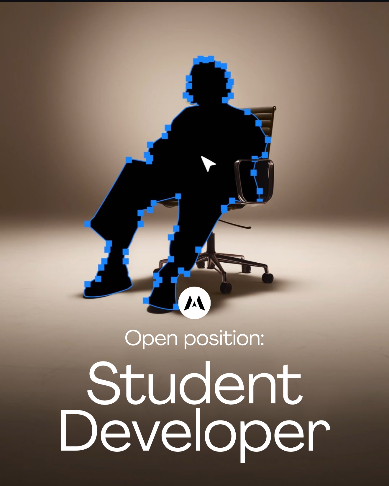

# Hiring

## **Student Developer Experience:**&#x20;

<figure><figcaption></figcaption></figure>


**Join as a Paid Maintainer**

_While navigating your college years, gaining hands-on industry experience and earning financial compensation can significantly build your professional foundation._&#x20;

_This platform is preparing for its next phase of growth. With upcoming releases scheduled for both our web platform and Android application, we are looking for the next generation of Student Developers to carry this legacy forward._

_This is a paid opportunity to take ownership of a live, production-grade project, allowing you to develop your skills as a Student Developer on a system with an active user base._

### Our Technology Stack

* **Web, 3D & Frontend:** Svelte, Vite, React, Zustand, React Three Fiber (R3F), Three.js, WebGL
* **Mobile:** Flutter, Provider, Go\_Router
* **Backend & Database:** Python, FastAPI, Pydantic, PostgreSQL, Alembic, Firebase
* **Infrastructure, DevOps & Version Control:** Google Cloud Run, Docker, Git workflow using GitHub for CI/CD

### Application Guidelines and Criteria

We prioritize actual engineering experience over a void facade. Apart from your project submissions, an active GitHub profile is a primary parameter for consideration. We are looking for genuine commit histories, readable repositories, and active coding habits—not the **\`excited to share'** LinkedIn posts or **'filtered'** Instagram profiles.

If you are ready to manage a live codebase and possess a core understanding of the Software Development Life Cycle (SDLC), we would like to see your work.

Please send your projects and GitHub profile to **studio@mantavyam.com**.

### What We Are Looking For (and What We Aren't)

* **Hands-on Developers, Not Prompters:** We are looking for developers who actually write code. Relying on prompting or basic AI generation is a strict no-go for this project. We value team members who understand the underlying logic, architecture, and debugging of their code.
* **Alternative Tracks (Design & Architecture):** If coding is not your primary focus, you can still apply. Strong know-how of User Interface (UI) Design, User Experience (UX) Principles, or System Design Architecture can also qualify you to work with us.
* **A Note on Originality:** Applications containing AI-generated slop, boilerplate code, or simple clones built by following YouTube tutorials will not be considered. We want to see original systems that you have designed and built yourself.

**How to build a portfolio if you don't have one:** If you do not have a project to showcase right now, we suggest building one to demonstrate your capability. Go on Upwork, find project descriptions from real client job postings, and build those solutions. Alternatively, source problem statements from credible hackathons organised by recognised institutions or government entities and solve them.

### Long-Term Opportunities & Game Development

* **Permanent Roles:** Student Developers who perform well on this project can be permanently hired to work on our studio's other active projects.
* **Game Development Track:** We are also actively recruiting for our game development projects. If you have experience building game applications using Unity or Unreal Engine, backed by strong foundations in C# and C++, we encourage you to highlight these projects in your application.

<a href="mailto:studio@mantavyam.com?subject=Application%20for%20Student%20Developer%20%2F%20Maintainer%20-%20%5BYour%20Name%5D&#x26;body=Full%20Name%3A%20%5BYour%20Name%5D%0D%0ACollege%20Year%20%26%20Branch%3A%20%5BYour%20Details%5D%0D%0A%0D%0AGitHub%20Profile%3A%20%5BLink%20to%20active%20GitHub%20profile%5D%0D%0A%0D%0ATrack%20Applied%20For%20%28Web%2C%20Mobile%2C%20Backend%2C%20UI%2FUX%2C%20Game%20Dev%29%3A%0D%0A%5BSpecify%20Track%5D%0D%0A%0D%0ABrief%20Cover%20Letter%20%28Why%20do%20you%20want%20to%20work%20on%20this%3F%29%3A%0D%0A%5BWrite%202-3%20sentences%20here%5D%0D%0A%0D%0AMy%20Featured%20Projects%20%28Original%20work%20only%29%3A%0D%0A1.%20Project%20Name%3A%20%0D%0A%20%20%20-%20GitHub%20Link%3A%20%0D%0A%20%20%20-%20Problem%20Solved%3A%20%0D%0A%20%20%20-%20Core%20Tech%20Stack%3A%20%0D%0A%0D%0A2.%20Project%20Name%3A%20%0D%0A%20%20%20-%20GitHub%20Link%3A%20%0D%0A%20%20%20-%20Problem%20Solved%3A%20%0D%0A%20%20%20-%20Core%20Tech%20Stack%3A%20%0D%0A%0D%0AApplicant%20Confirmations%20%28Mark%20with%20%27X%27%20to%20confirm%29%3A%0D%0A%5B%20%5D%20I%20am%20a%20developer%20who%20actually%20writes%20code%20%28not%20a%20prompting%20kid%29.%0D%0A%5B%20%5D%20My%20submission%20contains%20no%20AI%20slop%20or%20cloned%20tutorials.%0D%0A%5B%20%5D%20I%20am%20applying%20with%20genuine%20projects%20and%20code%2C%20not%20LinkedIn%20or%20Instagram%20profiles." class="button primary" data-icon="at">APPLY NOW</a>


