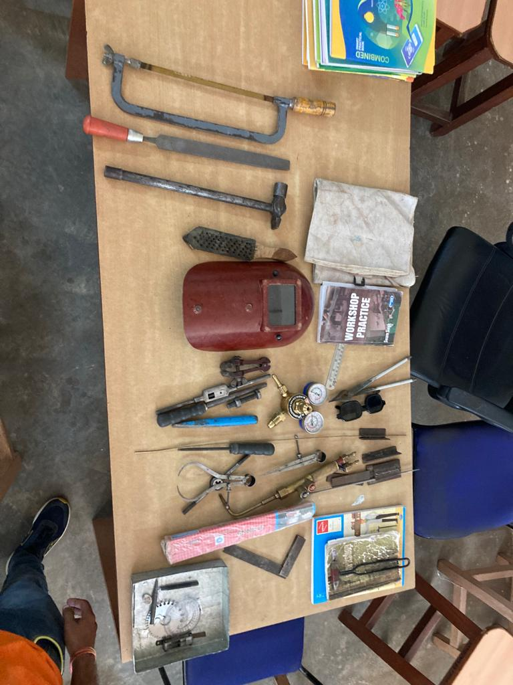
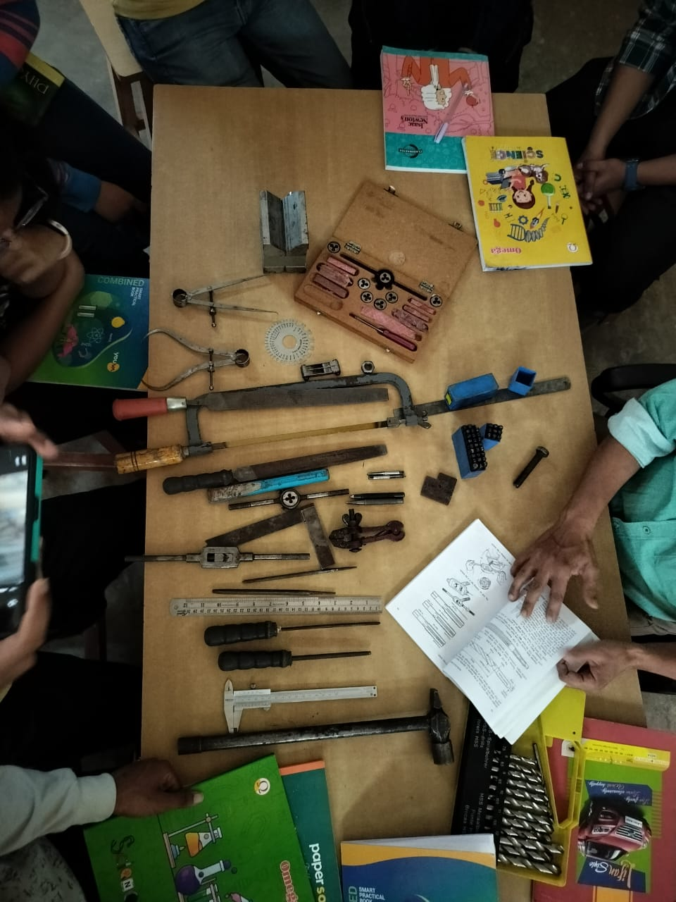

# BME124 / Workshop

## Syllabus



## References



## Resources


**DOWNLOAD Above Book PDF to refer to the Resources below!**

URL1: [https://www.scribd.com/document/441291341/Workshop-Practice-by-Swarn-Singh](https://www.scribd.com/document/441291341/Workshop-Practice-by-Swarn-Singh)

URL2: [https://drive.google.com/file/d/1GlPIWWMHGyZRbF8QYfce4gJ\_sgtdaRX\_/view](https://drive.google.com/file/d/1GlPIWWMHGyZRbF8QYfce4gJ_sgtdaRX_/view)


\[⤓] [Safety Guidelines](https://drive.google.com/file/d/1iXIP0tHvaKbGh9xzIZjZOpoK_T2PnTjh/view?usp=drive_link)

Machine shop

Page 188-212 from **Workshop Practice by Swarn Singh**

Fitting shop

Page 38-68 from **Workshop Practice by Swarn Singh**

\[⤓] [Fitting Shop](https://drive.google.com/file/d/1KwDogSQDG_YSX2En6lKnPaBlhpSfw6js/view?usp=drive_link)

Carpentry shop

Page 1-37 from **Workshop Practice by Swarn Singh**

Welding shop (Arc + Gas)

Page 69-93 from **Workshop Practice by Swarn Singh**

Smithy shop

Page 94-115 from **Workshop Practice by Swarn Singh**

***

## Notes

\[⤓] \[PDF] [BME124-Workshop-ShortNotes](https://drive.google.com/file/d/1TYDcItk4bQyngZEjJTItrUsxIEeK0j7G/view?usp=drive_link)

## Tools at a Glance

<figure><figcaption>
Workshop-Tools-Image-1
</figcaption></figure>

<figure><figcaption>
Workshop-Tools-Image-2
</figcaption></figure>


Get Credited for sharing your Knowledge Source with your Peers



