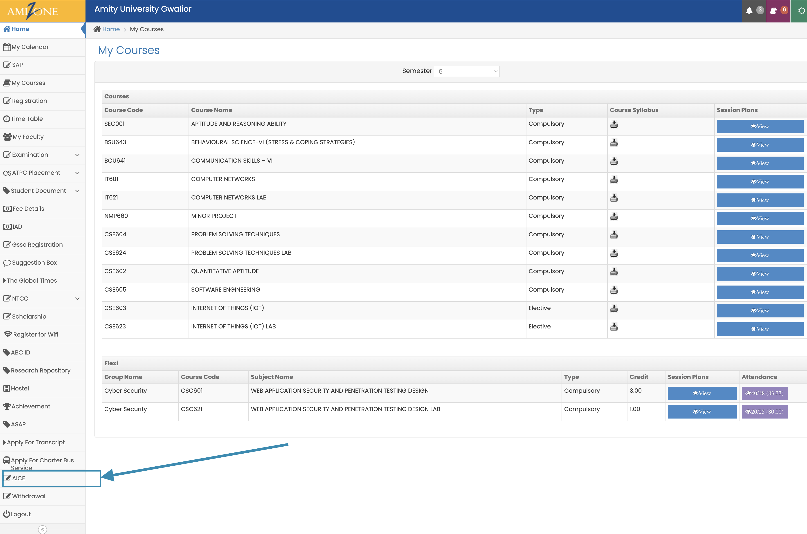
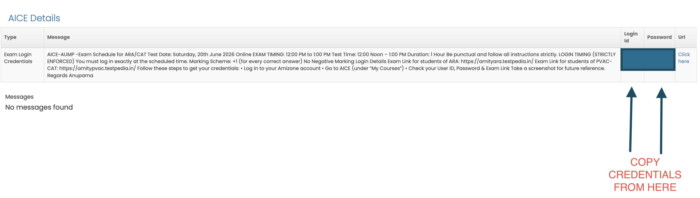

# SEC001 / ARA

## GUIDELINES

<strong>IMPORTANT DETAILS</strong>

* Enter login credentials exactly as provided (no extra spaces, do not remove hyphens).
* Tab switching is prohibited (Maximum of 3 warnings -> automatic termination, no reset).
* No screenshots, screen recording, or mobile usage allowed.
* Turn off all notifications (including WhatsApp).
* Clear browser history, cookies, and cache before starting the exam.
* Do not switch tabs or windows during the test.
* For Technical Support:
* Join the MS-Teams Link to resolve any issues.
  * **MS Teams Link:** (to be provided via your mentor) [https://teams.microsoft.com/{url-here}](https://teams.microsoft.com/%7Burl-here%7D)&#x20;

<strong>SCHEDULE</strong>

* **Test Date:** 1st Exam in your End Semester Schedule
* **Mode:** Online
* **Online Exam:** 12:00 PM to 1:00 PM
* _Be punctual and follow all instructions strictly._
* **Login Timing (Strictly Enforced):** You must log in exactly at the scheduled time.
* **Marking Scheme:** +1 for every correct answer.
* **Negative Marking:** None.

<strong>LOGIN DETAILS</strong>

* **Exam Link for Students:**
* **Portals:**
  1. [https://amitypvac.testpedia.in](https://amitypvac.testpedia.in)
  2. [https://amityara.testpedia.in](https://amityara.testpedia.in)
* **Steps to retrieve your credentials:**
  * Log in to your Amizone account.
  * Go to **AICE** (under "My Courses").
  * Verify your User ID, Password & Exam Link.
  * _Take a screenshot for future reference._

<strong>EXAM CONDUCT</strong>

* Enter login credentials exactly as provided (no extra spaces, do not remove hyphens).
* Late entry is not allowed after 2 minutes without HOI approval.
* If terminated due to misconduct, the exam will not be evaluated.

### Steps to Obtain Credentials:



### Go to AICE&#x20;

<figure><figcaption></figcaption></figure>



### Copy your Creds.

<figure><figcaption></figcaption></figure>



***

## Question Directory

<table>
    <thead>
        <tr>
            <th width="80">[⤓]</th>
            <th>Content Preview</th>
        </tr>
    </thead>
    <tbody>
        <tr>
            <td></td>
            <td><a href="https://drive.google.com/file/d/1ev1k1JAj2ob1k3VuCCbOqy-KClKKjKEa/view?usp=drivesdk">Y3S6-SEC001-ARA-EndSem-PYQ-JUN26-vaultscapes</a></td>
        </tr>
    </tbody>
</table>

***








