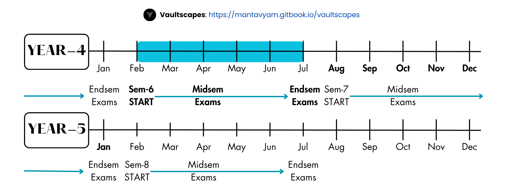

# Overview

## Syllabus

## Exam Schedule

<figure><figcaption></figcaption></figure>

## Subject Wise Resources

<table data-view="cards"><thead><tr><th data-type="content-ref"></th><th data-hidden data-card-cover data-type="image">Cover image</th></tr></thead><tbody><tr><td><a href="cse601/">cse601</a></td><td><a href=".gitbook/assets/icons-Vaultscapes-BTECH-sem-6-2.png">icons-Vaultscapes-BTECH-sem-6-2.png</a></td></tr><tr><td><a href="cse601/cse621.md">cse621.md</a></td><td><a href=".gitbook/assets/icons-Vaultscapes-BTECH-sem-6-2.png">icons-Vaultscapes-BTECH-sem-6-2.png</a></td></tr><tr><td><a href="cse602.md">cse602.md</a></td><td><a href=".gitbook/assets/icons-Vaultscapes-BTECH-sem-6-2.png">icons-Vaultscapes-BTECH-sem-6-2.png</a></td></tr><tr><td><a href="cse603/">cse603</a></td><td><a href=".gitbook/assets/icons-Vaultscapes-BTECH-sem-6-2.png">icons-Vaultscapes-BTECH-sem-6-2.png</a></td></tr><tr><td><a href="cse603/cse623.md">cse623.md</a></td><td><a href=".gitbook/assets/icons-Vaultscapes-BTECH-sem-6-2.png">icons-Vaultscapes-BTECH-sem-6-2.png</a></td></tr><tr><td><a href="cse604/">cse604</a></td><td><a href=".gitbook/assets/icons-Vaultscapes-BTECH-sem-6-2.png">icons-Vaultscapes-BTECH-sem-6-2.png</a></td></tr><tr><td><a href="cse604/cse624.md">cse624.md</a></td><td><a href=".gitbook/assets/icons-Vaultscapes-BTECH-sem-6-2.png">icons-Vaultscapes-BTECH-sem-6-2.png</a></td></tr><tr><td><a href="cse605.md">cse605.md</a></td><td><a href=".gitbook/assets/icons-Vaultscapes-BTECH-sem-6-2.png">icons-Vaultscapes-BTECH-sem-6-2.png</a></td></tr><tr><td><a href="it601/">it601</a></td><td><a href=".gitbook/assets/icons-Vaultscapes-BTECH-sem-6-1.png">icons-Vaultscapes-BTECH-sem-6-1.png</a></td></tr><tr><td><a href="it601/it621.md">it621.md</a></td><td><a href=".gitbook/assets/icons-Vaultscapes-BTECH-sem-6-1.png">icons-Vaultscapes-BTECH-sem-6-1.png</a></td></tr><tr><td><a href="bcu641.md">bcu641.md</a></td><td><a href=".gitbook/assets/icons-Vaultscapes-BTECH-sem-6-3.png">icons-Vaultscapes-BTECH-sem-6-3.png</a></td></tr><tr><td><a href="bsu643.md">bsu643.md</a></td><td><a href=".gitbook/assets/icons-Vaultscapes-BTECH-sem-6-4.png">icons-Vaultscapes-BTECH-sem-6-4.png</a></td></tr><tr><td><a href="nmp660.md">nmp660.md</a></td><td><a href=".gitbook/assets/icons-Vaultscapes-BTECH-sem-6-9.png">icons-Vaultscapes-BTECH-sem-6-9.png</a></td></tr><tr><td><a href="specialisation/csa601.md">csa601.md</a></td><td><a href=".gitbook/assets/icons-Vaultscapes-BTECH-sem-6-6.png">icons-Vaultscapes-BTECH-sem-6-6.png</a></td></tr><tr><td><a href="specialisation/csc601.md">csc601.md</a></td><td><a href=".gitbook/assets/icons-Vaultscapes-BTECH-sem-6-5.png">icons-Vaultscapes-BTECH-sem-6-5.png</a></td></tr><tr><td><a href="specialisation/csd601.md">csd601.md</a></td><td><a href=".gitbook/assets/icons-Vaultscapes-BTECH-sem-6-7.png">icons-Vaultscapes-BTECH-sem-6-7.png</a></td></tr><tr><td><a href="specialisation/csi601.md">csi601.md</a></td><td><a href=".gitbook/assets/icons-Vaultscapes-BTECH-sem-6-8.png">icons-Vaultscapes-BTECH-sem-6-8.png</a></td></tr><tr><td></td><td></td></tr></tbody></table>

## Notes

\[⤓] [IT601 — Module I\_Intro to data comm](https://drive.google.com/uc?export=download\&id=1FWkfThKm9VE4HjknYpx7MtiYBBjCLOer)

\[⤓] [IT601 — Module II\_ Data Link Layer](https://drive.google.com/uc?export=download\&id=1h0uZaiXdBxuObbD71lZbSEUZw2dGikFJ)

## Assignments

## Previous Year Questions

### Mid-Sem-PYQ

### End-Sem-PYQ






